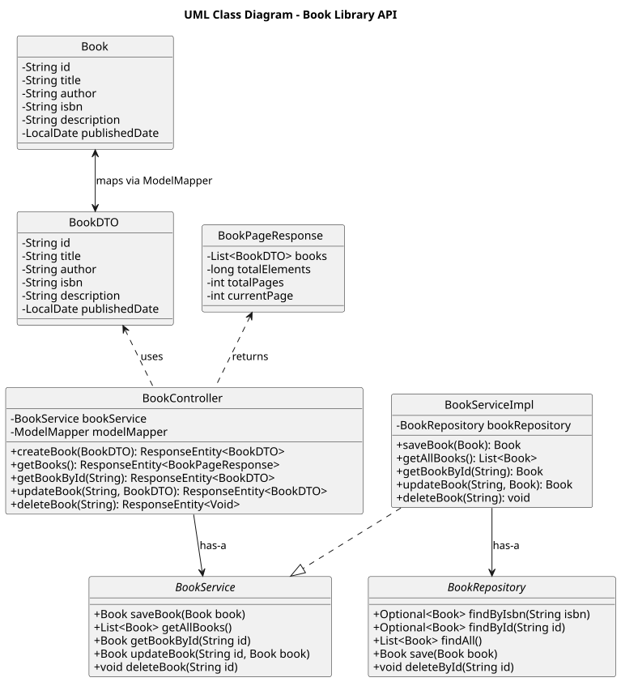
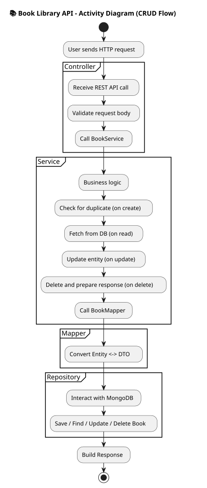
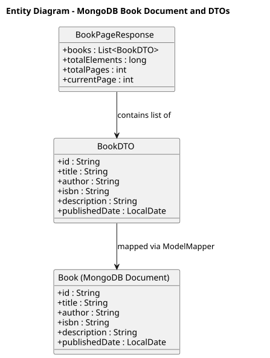
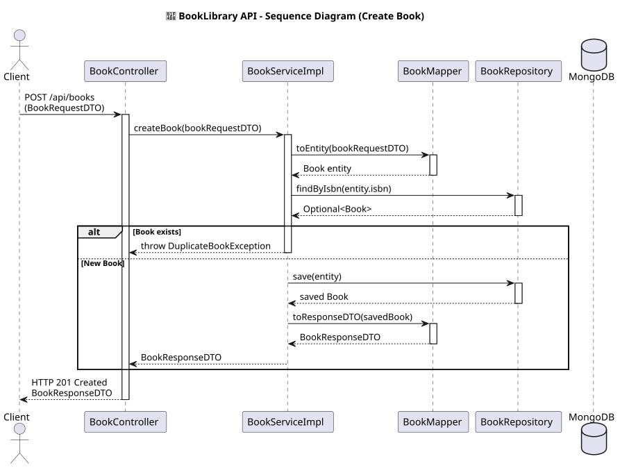

#  Book Library API

[]()
[]()
[]()
[]()
[]()
[]()

---

A backend REST API to manage books in a digital library, built using **Java 21**, **Spring Boot**, and **MongoDB**. It supports full CRUD operations, pagination, input validation, duplicate detection, structured error handling, Dockerized deployment, and Swagger API documentation.

---

##  Tech Stack

| Layer            | Tech / Tool                       |
|------------------|-----------------------------------|
| Language          | Java 21                           |
| Framework         | Spring Boot 3.2.5                   |
| Build Tool        | Maven                             |
| Database          | MongoDB (via Docker)              |
| API Docs          | Swagger (springdoc-openapi)       |
| Testing           | JUnit 5, Mockito                  |
| Containerization  | Docker, Docker Compose            |
| Monitoring        | Mongo Express                     |
| Validation        | Jakarta Bean Validation (JSR-380) |

---

##  Local Development Setup

###  Prerequisites

- Docker & Docker Compose
- Java 21 SDK (for manual run)
- Maven

### Option 1: Run via Docker (Recommended)

Step-by-step:

    ./mvnw clean package -DskipTests
    docker-compose down -v --remove-orphans
    docker-compose up --build -d

This spins up:

- MongoDB               → mongodb://localhost:27017
- Mongo Express UI      → http://localhost:8082 (Username: admin, Password: admin)
- Spring Boot API       → http://localhost:8085
- Swagger UI (API docs) → http://localhost:8085/swagger-ui.html

How to use:

- Use Postman with base URL:         http://localhost:8085/api/books
- Use Swagger UI (interactive docs): http://localhost:8085/swagger-ui.html

---

### Option 2: Run via Maven (No Docker)

Make sure MongoDB is already running locally on default port 27017.  
Set the following in your `application.properties`:

    spring.data.mongodb.uri=mongodb://localhost:27017/book_library_db

Then run:

    mvn clean install
    mvn spring-boot:run

How to use:

- Postman base URL:                  http://localhost:8085/api/books
- Swagger UI for API documentation: http://localhost:8085/swagger-ui.html


##  API Endpoints

| Method | Endpoint            | Description                  |
|--------|---------------------|------------------------------|
| GET    | `/api/books`        | List all books (paginated)  |
| POST   | `/api/books`        | Add a new book (no duplicates) |
| GET    | `/api/books/{id}`   | Get book by ID              |
| PUT    | `/api/books/{id}`   | Update book by ID           |
| DELETE | `/api/books/{id}`   | Delete book by ID           |

---

##  Input Validation & Duplicate Detection

- All inputs are validated using `@Valid` and Jakarta Bean Validation.
- **Duplicate books (based on ISBN)** are rejected:
    - Returns `400 Bad Request` with error:  
      `"Book with ISBN 978-1234567890 already exists."`
- A **Global Exception Handler** returns consistent JSON error responses.

##  Project Structure
```bash
book_library 
.
├── Dockerfile
├── README.md
├── book-library-bulk-post-100-books-final.postman_collection2.json
├── diagrams
│   ├── Component Diagram - Book Library API Architecture.svg
│   ├── activity-diagram.svg
│   ├── class-diagram.svg
│   ├── entity-diagram.svg
│   └── sequence-diagram.svg
├── docker-compose.yml
├── logs
├── mvnw
├── mvnw.cmd
├── pom.xml
├── src
│   ├── main
│   │   ├── java
│   │   │   └── com
│   │   │       └── neeraj
│   │   │           └── book_library
│   │   │               ├── BookLibraryApplication.java
│   │   │               ├── bootstrap
│   │   │               │   └── DataSeeder.java
│   │   │               ├── config
│   │   │               │   └── ModelMapperConfig.java
│   │   │               ├── controller
│   │   │               │   └── BookController.java
│   │   │               ├── dto
│   │   │               │   ├── ApiErrorResponse.java
│   │   │               │   ├── ApiResponseWrapper.java
│   │   │               │   ├── BookPageResponse.java
│   │   │               │   ├── BookRequestDTO.java
│   │   │               │   ├── BookResponseDTO.java
│   │   │               │   └── DeleteResponseDTO.java
│   │   │               ├── entity
│   │   │               │   └── Book.java
│   │   │               ├── exception
│   │   │               │   ├── BookNotFoundException.java
│   │   │               │   ├── DuplicateBookException.java
│   │   │               │   └── GlobalExceptionHandler.java
│   │   │               ├── mapper
│   │   │               │   └── BookMapper.java
│   │   │               ├── repository
│   │   │               │   └── BookRepository.java
│   │   │               └── service
│   │   │                   ├── BookService.java
│   │   │                   └── BookServiceImpl.java
│   │   └── resources
│   │       ├── application.properties
│   │       ├── data.json
│   │       ├── static
│   │       └── templates
│   └── test
│       ├── java
│       │   └── com
│       │       └── neeraj
│       │           └── book_library
│       │               ├── ApplicationSmokeTest.java
│       │               ├── BookLibraryApplicationSmokeTest.java
│       │               ├── bootstrap
│       │               │   └── DataSeederTest.java
│       │               ├── config
│       │               │   └── ModelMapperConfigTest.java
│       │               ├── controller
│       │               │   ├── BookControllerEdgeCaseTests.java
│       │               │   ├── BookControllerIntegrationTest.java
│       │               │   └── BookControllerTest.java
│       │               ├── dto
│       │               │   ├── BookDTOValidationTest.java
│       │               │   ├── BookPageResponseTest.java
│       │               │   ├── BookResponseDTOTest.java
│       │               │   └── DeleteResponseDTOTest.java
│       │               ├── exception
│       │               │   ├── BookNotFoundExceptionTest.java
│       │               │   ├── DuplicateBookExceptionTest.java
│       │               │   └── GlobalExceptionHandlerTest.java
│       │               ├── mapper
│       │               │   └── BookMapperTest.java
│       │               ├── repository
│       │               │   └── BookRepositoryIntegrationTest.java
│       │               └── service
│       │                   └── BookServiceImplTest.java
│       └── resources
│           ├── application-test.properties
│           └── data-test.json
└── target
    ├── classes
    │   ├── application.properties
    │   └── data.json
    ├── generated-sources
    │   └── annotations
    └── maven-status
        └── maven-compiler-plugin
            └── compile
                └── default-compile
                    ├── createdFiles.lst
                    └── inputFiles.lst


```

##  Class Diagram
The following diagram illustrates the high-level structure of the Book Library system:

## Activity Diagram

## Entity Diagram

## Sequence Diagram



---

##  Design Patterns & Principles

The project adheres to clean code practices and applies the following design patterns and SOLID principles:

### Design Patterns
- **Builder Pattern** – Used in `Book` entity via Lombok to simplify object creation.
- **Singleton Pattern** – `ModelMapper` and other beans are singletons via Spring’s `@Bean` annotation.
- **DTO Pattern** – `BookDTO` and `BookPageResponse` separate transport layer from domain logic.
- **Proxy/Decorator Pattern** – Spring AOP & annotations like `@Validated`, `@Transactional`, and `@JsonFormat`.
- **Strategy Pattern** – Validation and duplicate detection logic encapsulated in the service layer.
- **Factory Pattern (Spring)** – Spring IoC container instantiates beans, following the Factory pattern implicitly.

### SOLID Principles
- **SRP** – Layered architecture separates concerns cleanly (Controller, Service, Repository, DTO).
- **OCP** – Service logic is easily extensible without modifying core classes.
- **LSP** – Interface-based `BookService` ensures substitutability with different service implementations.
- **ISP** – BookService interface remains minimal, exposing only domain-relevant methods.
- **DIP** – Controllers depend on `BookService` interface, not the implementation.

> These patterns help keep the codebase maintainable, extensible, and production-grade.

---

##  Testing Strategy

-  Unit Tests:
- `BookServiceImplTest`
- `BookControllerTest`
-  Integration Tests:
- MongoDB interaction via `@DataMongoTest`
- Smoke test for context loading
-  Run All Tests:
```bash
./mvnw test
```

---

##  Data Model

```java
public class Book {
  @Id
  private String id;
  private String title;
  private String author;
  private String isbn;
  private String description;

  @JsonFormat(pattern = "yyyy-MM-dd")
  private LocalDate publishedDate;
}
```

---

##  Dockerized Deployment

- `Dockerfile`: builds the Spring Boot app with Java 21
- `docker-compose.yml`: spins up:
    - MongoDB
    - Mongo Express UI
    - Spring Boot container
- MongoDB URI is injected via `.env` → picked in `application.properties`

---

##  API Documentation

- Swagger UI → http://localhost:8085/swagger-ui.html
- OpenAPI Spec → /v3/api-docs

---

##  Design Patterns & SOLID Principles

###  Design Patterns

- **Builder** – via Lombok
- **DTO** – for transport abstraction
- **Singleton** – Spring beans
- **Strategy** – duplicate check strategy in service
- **Factory** – implicit Spring DI

###  SOLID

- SRP, OCP, LSP, ISP, DIP – Fully followed in service and controller structure.

---

##  Contributing

```bash
# Steps to Contribute
git clone https://github.com/your-user/book-library.git
cd book-library
git checkout -b feature/your-feature
# Make changes and commit
git push origin feature/your-feature
# Open Pull Request
```

---

##  Known Limitations

-  No authentication (e.g., Spring Security)
-  In-memory MongoDB (optional: persist volumes)
-  No CI/CD yet (can be added via GitHub Actions)
